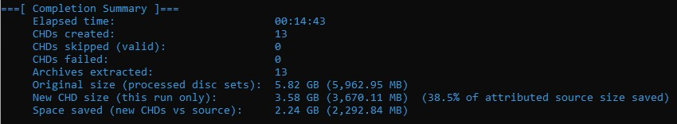

# CHD-Maid


 


`CHD-Maid` is a PowerShell script that **recursively** scans a **`-source`** tree for disc images (`.cue`, `.gdi`, `.iso`) **and** common archives (`.zip`, `.7z`, `.rar`). Archives are **extracted under `-source`** using **7-Zip**; then each image job runs **`chdman -createcd`** followed by **`chdman -verify`,** ensuring all CHDs are verified. The script prints **elapsed time** and **per-step progress** (including 7-Zip extract), writes a **UTF-8 formatted logfile** under the subdirectory **`logs\`**, and at the end shows a **completion summary.**

**Help (`-help`)**


Terminal window displaying CHD-Maid help output.

**Typical run**


Beginning of the process with parameters for source and destination folders already passed. Additional discovery counts, the start command (for copying and reusing) as well as the location of the log file.

**Process example**


Output from converting a bin/iso image to chd.

**Process complete**



Sample ending completion summary

## System requirements
| Requirement | Notes |
|-------------|--------|
| **PowerShell** | **7.6.0 or newer** (`pwsh`). The script exits early on older versions, redirecting to [Install PowerShell](https://github.com/PowerShell/PowerShell/releases). |
| **chdman** | **`chdman.exe` must live in the directory you run the script from.** If `chdman.exe` is missing, the script stops with an error. |
| **7-Zip** | **Required if `-source` contains any `.zip` / `.7z` / `.rar`.** The script looks for `7z.exe` under `Program Files`, or via **`-SevenZipPath`**. Version **26.0.0** was used during development.|
| **OS** | Written using Windows 11 25H2. |

## Quick start

```powershell
cd D:\path\to\chdmaid
.\chd-maid.ps1 -source "D:\rips" -dest "D:\chd-out" -no
```

If you omit `-source` or `-dest`, the script **prompts** for each; pressing Enter uses the **current directory** as the default for that prompt.

## Parameters and flags
| Parameter / flag | Type | Description |
|------------------|------|-------------|
| `-source` | string | Root folder to **recursively** scan for disc images and archives. If omitted, you are prompted for a value. |
| `-dest` | string | Folder where **`.chd` files will be written** (created if missing). Output CHDs always sit **at the top level of `-dest`**. |
| `-SevenZipPath` | string | Optional path to **`7z.exe`** or its parent folder. Aliases: **`-Path7z`**, **`-zpath`**. |
| `-yes` | switch | After a successful **create** and **verify**, **delete** sources: primary image, **`.cue`** referenced bins, **`.gdi`** referenced data files, **per-game folders** when safe, and—when applicable—the **archive file** and **unpack folder** behavior documented in **`-help`**. **Mutually exclusive** with `-no`. |
| `-no` | switch | **Do not** delete original **loose** sources that live outside an archive unpack tree (default when neither flag is passed). **Unpack folders** for archives are still removed after a successful pass; **`-no`** keeps the **archive file** on disk. |
| `-nolog` | switch | **No log file** for a **fully successful** run. On the first conversion failure, a log may still be created with failure details. |
| `-help` | switch | Show built-in help and exit. Also accepts `-?`, `--help`, `/help` as unbound arguments. |

**Rules:**
- When providing either the source or destination directory, you can press <ENTER> to use the current folder where `chdman` and `chd-maid` are located.
- The parameters, `-yes` or `-no` are mutually exclusive. The script throws if both are set.
- Regardless of using the `-yes-` or `-no` option, files that are extracted from compressed archives are deleted after the CHD file is verified.
- If any error occurs during the creation of a `.chd` file, the error will be logged, even when the `-nolog` parameter is passed.

## Usage examples
**Convert everything under the base directory, output to a folder, keep sources:**

```powershell
.\chd-maid.ps1 -source "D:\Input\GDI" -dest "D:\Output\CHD" -no
```

**Same, but delete originals after success:**

```powershell
.\chd-maid.ps1 -source "D:\Input\GDI" -dest "D:\Output\CHD" -yes
```

**Point 7-Zip explicitly (folder or `7z.exe`):**

```powershell
.\chd-maid.ps1 -source "D:\input" -dest "D:\output" -Path7z "D:\7-Zip" -no
```

**Successful run with no log file:**

```powershell
.\chd-maid.ps1 -source "D:\input" -dest "D:\output" -no -nolog
```

**Interactive paths (prompted for source and/or destination):**

```powershell
.\chd-maid.ps1
```

**Show help:**

```powershell
.\chd-maid.ps1 -help
```

## How output files are named

For each input file `SomeName.cue` (or `.gdi` / `.iso`), the script writes:

`\<dest>\SomeName.chd`

So everything lands **directly under `-dest`**, not in subfolders mirroring the source folder.

## Expected behavior and output

1. **Header** - Script title and version banner (e.g. `CHD-Maid`, dated version string).
2. **Configuration** - Prints **Source**, **Destination**, and **Delete sources** (Yes/No).
3. **Counts** - Compatible inputs found (disc images **plus** a nominal count per archive when present); number of existing `*.chd` files under **`-dest`** (recursive).
4. **Log** - Path to a new log file: **`logs\log-chd-maid-YYYY-MM-dd-HHmmss.log`** (the **`logs`** folder is created if needed).
   	- Omit with **`-nolog`** when the run ends fully successful.
6. **Traversal** - Subdirectories are processed in full **before** archives and disc files at the same level, so nested layouts and archives beside cues are handled in a stable order.
7. **Archives** - Each archive unpacks to **`-source\<archive name>\`** (with ` (2)`, ` (3)`, … if the name already exists). Nested archives inside that tree are expanded in turn.
8. **Per disc input**  
   	- If `SomeName.chd` **already exists**: runs **`chdman verify`** on it. 
   	-- If verify succeeds, the file is **skipped** (sources untouched). 
   	-- If verify fails, the CHD is **removed** and **recreated** from the source.  
   	- Otherwise: **`chdman createcd`** then **`chdman verify`** on the new CHD. If verify fails after create, the bad output CHD is **removed**.  
   	- Progress is shown as a **status line** (elapsed time, percentage from tool output where available, file name).
9. **After an archive pass** - When all jobs under that unpack tree succeed, the **extracted folder** is removed **before** continuing to the next source item.
	- **`-yes`** also removes the **archive file**, **`-no`** keeps it.
11. **On success with `-yes`** - Deletes sources per rules above (cue bins, GDI data files, optional whole game folder cleanup).
12. **Completion summary** provides:
	- Elapsed time
	- Counts where non-zero:
	-- CHDs created
    -- CHDs skipped (valid)
    -- CHDs failed during creation
	-- Archives extracted (if any)
	- Optional **size** lines: original material accounted for (archive **file sizes** plus loose-folder footprint), new CHD total this run, space saved (with an optional **%** on the New CHD line when attribution applies)

### Exit codes

| Code | Meaning |
|------|---------|
| `0` | No failures (may have skips). Also used when **no** `.cue`/`.gdi`/`.iso` jobs complete (warning only). |
| `1` | At least one failure, **or** PowerShell version too old, **or** missing **`chdman.exe` / `7z.exe`** when needed, **or** fatal script error. |

### Log file contents

- Start command echo and discovery counts.
- For each processed item: source path, and a line such as `VERIFIED`, `SKIPPED (already existed and valid)`, `FAILED`, or `REMOVED (failed verify)`.
- Final completion summary lines appended at the end when logging is enabled or any job failed.

## Troubleshooting

- chdman.exe does not exist in the executed directory
	- make sure that `chdman.exe` and `chd-maid.ps1` live in the same directory.
- The minimal requirement is PowerShell 7.6.0
 	- Upgrade `pwsh` from the [PowerShell releases](https://github.com/PowerShell/PowerShell/releases) page.
- 7-Zip / archive errors
	- Install [7-Zip](https://www.7-zip.org/download.html) or pass **`-SevenZipPath`** to `7z.exe` or its folder; archives under `-source` require it.
- No inputs found
	- Confirm files are under `-source` with extensions **`.cue`**, **`.gdi`**, or **`.iso`** (after any archives are extracted, if applicable).

## License

This project is licensed under the **MIT License** — see the [`LICENSE`](LICENSE) file in the repository.

*CHD-Maid is a convenience wrapper around `chdman`; comply with MAME/chdman licensing when you distribute or use their tools.*
