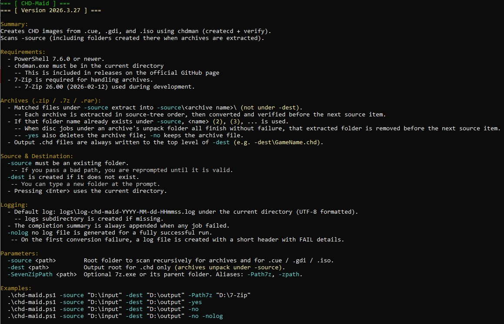
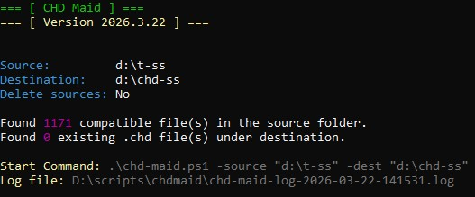
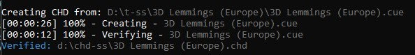

# CHD-Maid
 

`CHD-Maid` ia a PowerShell wrapper (running as a subprocess) that scans the defined source folder for disc images (`.cue`, `.gdi`, `.iso`) and converts them to **MAME CHD** format using **chdman** (`createcd` + `verify`). It shows per-file progress, progress time, writes a UTF-8 log, and optionally removes source files after a successful create and verify.

**Help (`-help`)**



Terminal window displaying CHD-Maid help output.

**Typical run**



Beginning of the process with parameters for source and destination folders already passed. Additional discovery counts, the start command (for copying and reusing) as well as the location of the log file.

**Process example**



Output from converting a bin/iso image to chd.

**Process complete**
( upload image )
Ending completion summary

## System requirements
| Requirement | Notes |
|-------------|--------|
| **PowerShell** | **7.6.0 or newer** (`pwsh`). The script exits early on older versions, redirecting to [Install PowerShell](https://github.com/PowerShell/PowerShell/releases). |
| **chdman** | **`chdman.exe` must live in the directory you run the script from.** If `chdman.exe` is missing, the script stops with an error. |
| **OS** | Written using Windows 11. |

## Quick start

```powershell
cd D:\path\to\chdmaid
pwsh -File .\chd-maid.ps1 -source "D:\rips" -dest "D:\chd-out" -no
```

If you omit `-source` or `-dest`, the script **prompts** for each; pressing Enter uses the **current directory** as the default for that prompt.

## Parameters and flags
| Parameter / flag | Type | Description |
|------------------|------|-------------|
| `-source` | `string` | Root folder to **recursively** scan for `*.cue`, `*.gdi`, and `*.iso`. If omitted, you are prompted for a value. |
| `-dest` | `string` | Folder where **`.chd` files are written** (created if missing). Default when omitted or blank: **current directory**. If omitted, you are prompted for a value. |
| `-yes` | switch | After a successful **create** and **verify**, **delete** the source disc image (and, for `.cue`, referenced `.bin` files that exist next to the cue). **Mutually exclusive** with `-no`. |
| `-no` | switch | **Do not** delete sources (this is the **default** if neither `-yes` nor `-no` are passed). |
| `-help` | switch | Show built-in help and exit. Also accepts `-?`, `--help`, `/help` as unbound arguments. |

**Rules:**
- Use **only one** of `-yes` or `-no` (not both).
- You cannot combine conflicting delete flags; the script throws if both are set.

## Usage examples
**Convert everything under the base directory, output to a folder, keep sources:**

```powershell
.\chd-maid.ps1 -source "D:\Dreamcast\GDI" -dest "D:\Dreamcast\CHD" -no
```

**Same, but delete originals after success:**

```powershell
.\chd-maid.ps1 -source "D:\Dreamcast\GDI" -dest "D:\Dreamcast\CHD" -yes
```

**Interactive paths (prompted for source and/or destination):**

```powershell
.\chd-maid.ps1
```

**Show help:**

```powershell
.\chd-maid.ps1 -help
```

## How output files are named

For each input file `SomeName.cue` (or `.gdi` / `.iso`), the script writes:

`\<dest>\SomeName.chd`

So everything lands **directly under `-dest`**, not in subfolders mirroring the source folder.

## Expected behavior and output

1. **Header** - Script title and version banner (e.g. `CHD Maid`, dated version string).
2. **Configuration** - Prints **Source**, **Destination**, and **Delete sources** (Yes/No).
3. **Counts** - Number of matching inputs found; number of existing `*.chd` files under the destination (recursive).
4. **Log** - Path to a new log file: `chd-maid-log-YYYY-MM-DD-HHmmss.log` in the **current working directory**.
5. **Per input**  
   - If `SomeName.chd` **already exists**: runs **`chdman verify`** on it. 
   -- If verify succeeds, the file is **skipped** (sources untouched). 
   -- If verify fails, the file is **removed** and **recreated** from the source.  
   - Otherwise: **`chdman createcd`** then **`chdman verify`** on the new CHD.  
   - Progress is shown as a **status line** (elapsed time, percentage parsed from `chdman` output, file name).
6. **On success with `-yes`** - Deletes the primary source file; for `.cue`, also deletes **referenced** bin files that were found on disk.
7. **Completion summary** provides:
	- Elapsed time
	- Counts for: 
	-- CHDs created
    -- CHDs skipped (valid)
    -- CHDs failed during creation

### Exit codes

| Code | Meaning |
|------|---------|
| `0` | No failures (may have skips). Also used when **no** `.cue`/`.gdi`/`.iso` files are found (warning only). |
| `1` | At least one failure, **or** PowerShell version too old, **or** missing `chdman.exe`, **or** fatal script error. |

### Log file contents

- Start command echo and discovery counts.
- For each processed item: source path, and a line such as `VERIFIED`, `SKIPPED (already existed and valid)`, `FAILED`, or `REMOVED (failed verify)`.
- Final completion summary lines appended at the end.

## Troubleshooting

- **`chdman.exe does not exist in the executed directory`** 
	- make sure that `chdman.exe` and `chd-maid.ps1` live in the same directory.
- **`The minimal requirement is PowerShell 7.6.0`** 
 	- Upgrade `pwsh` from the [PowerShell releases](https://github.com/PowerShell/PowerShell/releases) page.
- **No inputs found** 
	- Confirm files are under `-source` with extensions **`.cue`**, **`.gdi`**, or **`.iso`**.

## License

This project is licensed under the **MIT License** — see the [`LICENSE`](LICENSE) file in the repository.
*CHD Maid is a convenience wrapper around `chdman`; comply with MAME/chdman licensing when you distribute or use their tools.*
